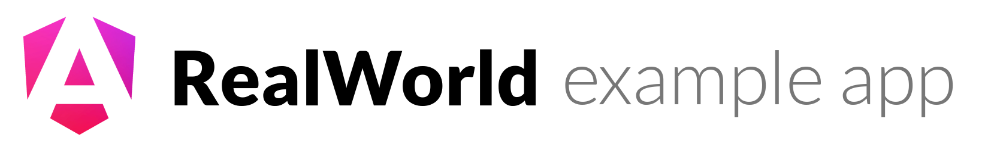

# 

> Angular "Conduit" app (a Medium.com clone) with only a minimal E2E-testing setup.

This codebase is a fork of the [RealWorld](https://realworld.show) Angular
example app: a fully fledged Angular application that talks to a real backend
(CRUD, JWT auth, routing, pagination, favorites, following, ...).

## Getting started

Requires [Bun](https://bun.sh/docs/installation) (or npm - both work).

```bash
git clone <your-fork-url>
cd angular-realworld-example-app
bun install        # or: npm install
bun run start      # dev server at http://localhost:4200
```

The app talks to the public RealWorld API by default, so you need internet
access. You can register a throwaway account from the app's Sign-up page.

### Tests

```bash
bun run test       # unit tests (Vitest)
bun run test:e2e   # end-to-end tests (Playwright) — starts the dev server automatically
```

Your E2E tests go in `e2e/`; the Playwright config is `playwright.config.ts`.

## Functionality overview

A social blogging site ("Conduit"). Pages: Home (`/`, article feeds + tags +
pagination), Sign in / Sign up (`/login`, `/register`, JWT), Settings
(`/settings`), Article editor (`/editor`), Article view (`/article/:slug`,
comments), Profile (`/profile/:username`).

## License

- **Project code**: [MIT License](LICENSE)
- Based on the [RealWorld](https://realworld.show) project.
